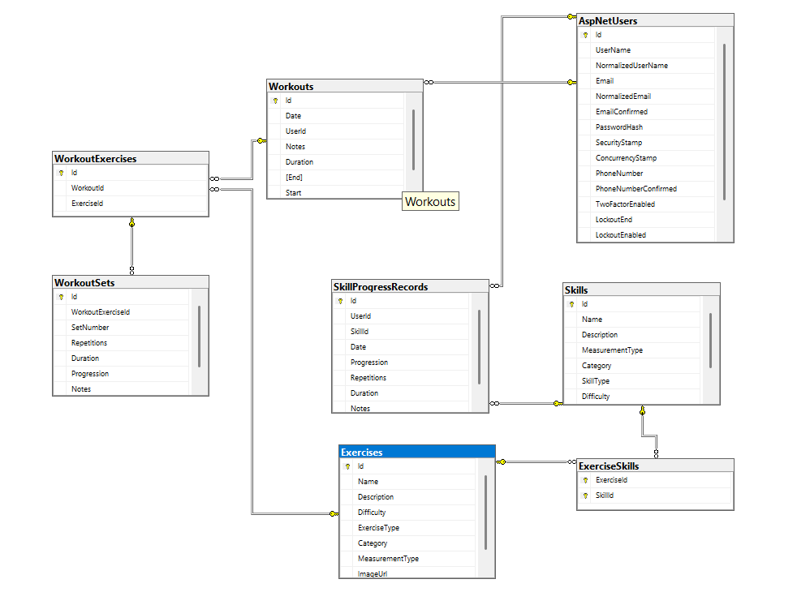

# 🚀 Calisthenics Skill Tracker

This app will help you keep progress of your workouts, discover new skills and exercises, and help you advance in the sport.

.NET Version ASP.NET Core License

## 📋 Table of Contents

*   [About the Project](#about-the-project)
*   [Technologies Used](#technologies-used)
*   [Prerequisites](#prerequisites)
*   [Getting Started](#getting-started)
*   [Project Structure](#project-structure)
*   [Features](#features)
*   [Usage](#usage)
*   [Database Setup](#database-setup)
*   [Configuration](#configuration)
*   [Contributing](#contributing)
*   [License](#license)
*   [Contact](#contact)

## 📖 About the Project

**Calisthenics Skill Tracker** is a web application built with ASP.NET Core MVC that allows users to track their workouts, log exercises, and monitor skill progression. It provides an organized way to discover new exercises and skills while maintaining a record of personal achievements in calisthenics.

This app is aimed at fitness enthusiasts who want to systematically advance in their sport and track their performance over time.

## 🛠️ Technologies Used

| Technology | Version | Purpose |
| --- | --- | --- |
| ASP.NET Core MVC | 6.0 | Web framework |
| Entity Framework Core | 6.0 | ORM / Database access |
| SQL Server | - | Database |
| Bootstrap | 5.x | Frontend styling |
| Plain CSS | - | Custom styles |
| Razor Views | - | Server-side HTML rendering |

## ✅ Prerequisites

*   [.NET SDK 6.0+](https://dotnet.microsoft.com/en-us/download/dotnet/6.0)
*   [Visual Studio 2022](https://visualstudio.microsoft.com/) or [VS Code](https://code.visualstudio.com/)
*   [SQL Server](https://www.microsoft.com/en-us/sql-server)
*   [Git](https://git-scm.com/)

## 🚀 Getting Started

### 1\. Clone the repository

git clone https://github.com/your-username/calisthenics-skill-tracker.git  
cd calisthenics-skill-tracker

### 2\. Restore dependencies

dotnet restore

### 3\. Apply database migrations

dotnet ef database update

### 4\. Run the application

dotnet run

App available at https://localhost:5001 or http://localhost:5000.

## 📁 Project Structure

CalisthenicsSkillTracker/  
│  
├── Controllers/ # MVC Controllers for Workouts, Exercises, Skills  
├── Models/ # Domain models and ViewModels  
├── Views/ # Razor Views (.cshtml)  
├── Data/ # DbContext and migrations  
├── Services/ # Business logic / service layer  
├── wwwroot/ # Static files (CSS, JS, images)  
├── appsettings.json # App configuration  
└── Program.cs # App entry point and middleware setup

## ✨ Features

*   User registration and login (ASP.NET Identity)
*   Log workouts with sets, reps, duration, and notes
*   CRUD operations for Exercises and Skills
*   Track user progress in different calisthenics skills
*   Responsive UI with Bootstrap and custom CSS
*   Conditional display of sets if values are null

## 💻 Usage

1.  Navigate to /Register to create an account.
2.  Log in at /Login.
3.  Browse/Add/Edit exercises and skills in the dashboard.
4.  Log workouts via the /Workout/Log page.
5.  Mark favorite exercises and skills for easy access.
6.  View your progress and skill levels over time.

## 🗄️ Database Setup

Connection string in appsettings.json:

"ConnectionStrings": {  
"DefaultConnection": "Server=(localdb)\\\\mssqllocaldb;Database=CalisthenicsSkillTrackerDb;Trusted\_Connection=True;"  
}

To create and seed the database:

dotnet ef migrations add InitialCreate  
dotnet ef database update

### Database Diagram

| Database Diagram |
| --- |

## ⚙️ Configuration

Key settings in appsettings.json:

{  
"ConnectionStrings": {  
"DefaultConnection": "your-connection-string-here"  
},  
"Logging": {  
"LogLevel": {  
"Default": "Information"  
}  
}  
}

⚠️ Never commit sensitive data. Use appsettings.Development.json or environment variables.

## 📄 License

[Apache-2.0 license.](https://github.com/cvetkovalexander/CalisthenicsSkillTracker#Apache-2.0-1-ov-file)

## 📬 Contact

**Alexander Cvetkov**

https://github.com/cvetkovalexander

Project Link: https://github.com/cvetkovalexander/CalisthenicsSkillTracker

_Built as part of the \*\*ASP.NET Fundamentals\*\* course_